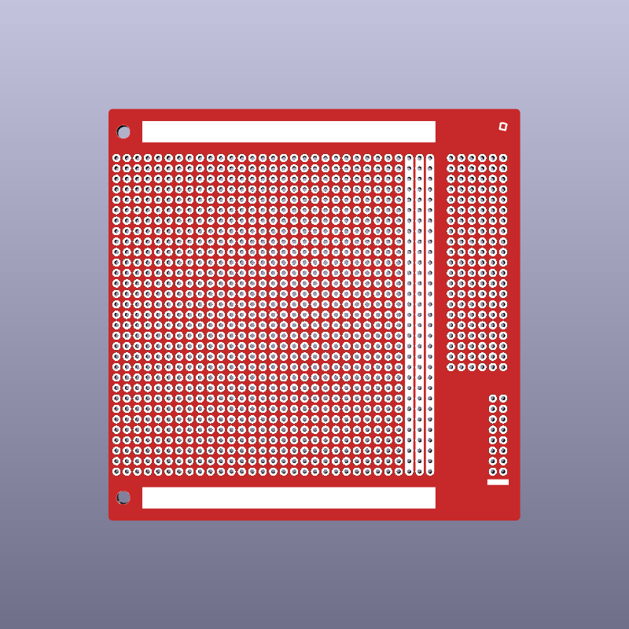
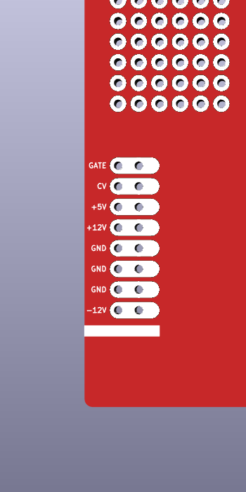

# 3U-100 Eurocard Eurorack Protoboard

This is a board for modular synth prototyping. The PCB has the 3U-100 Eurocard format. It is intended to be mounted in chassis with card guides on the top and bottom. Its dimensions are based on the standards DIN EN 60297-3-101, IEC 60297-3-101, IEEE 1101.1 and IEEE 1101.10 (with the exception of minimally larger front panel bracket mounting holes: 3.2 instead of 2.7 ±1 mm). The protoboard uses the standard grid spacing of 2.54 mm (100 mils). The only copper traces on this PCB connect the through-hole pads on each of the three freely usable rails. A provision for a pin or box header for 16-position IDC connectors is made towards the rear of the board.

On the back (solder side) the header pins are labelled to mitigate confusion. The enlarged pads make attaching wires a little easier.

Dimensions: 100 x 100 mm

Mounting hole spacing: 88.9 mm (~3 mm hole diameter)

This work is licensed under a [Creative Commons Attribution-NonCommercial-ShareAlike 4.0 International License](https://creativecommons.org/licenses/by-nc-sa/4.0/).
